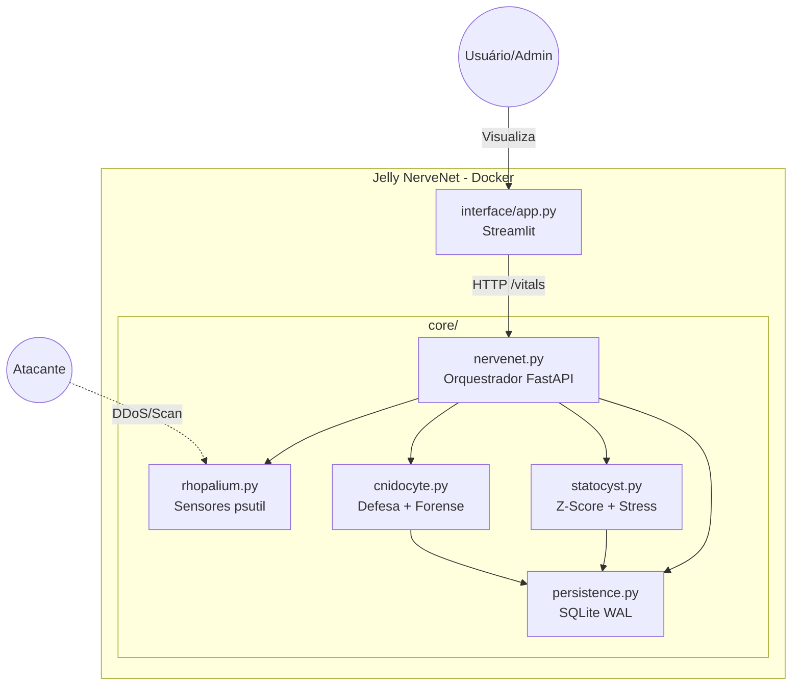
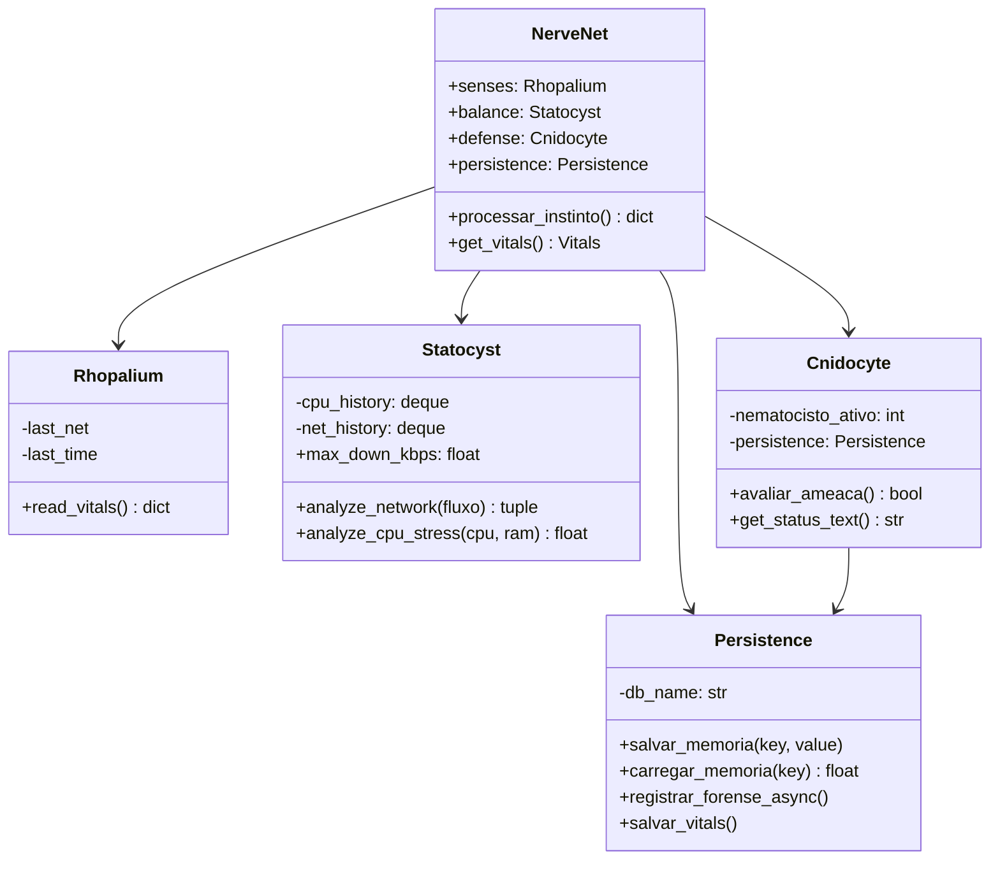
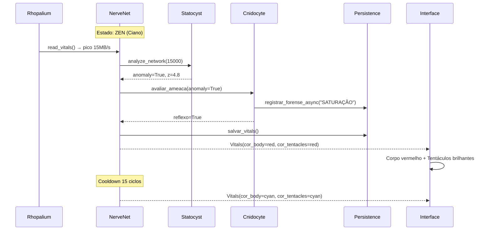
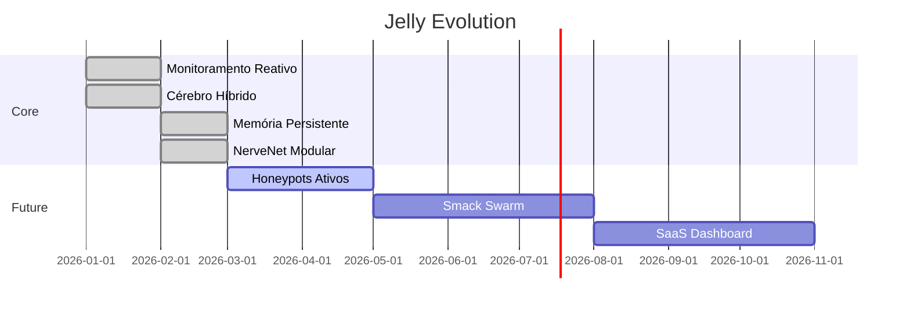

# 🪼 Jelly Nervous System (JNS) - Architecture

> *"A natureza não faz nada em vão."* - Aristóteles

A **Jelly** é um Sistema de Detecção de Intrusão (IDS) biomimético que utiliza conceitos de "Calm Technology" para monitorar a saúde de servidores e dispositivos Edge. Diferente de logs tradicionais, a Jelly traduz métricas de estresse em bioluminescência (cores HSL) e reage a ameaças disparando contramedidas defensivas (Nematocistos).

---

## 🏗️ Diagrama de Arquitetura



---

## 📋 Requisitos Funcionais

| ID | Requisito | Status |
|---|---|---|
| **RF001** | Monitorar CPU, RAM, Disco e Rede via psutil | ✅ |
| **RF002** | Detectar anomalias via Z-Score (threshold > 3.0) | ✅ |
| **RF003** | Disparar Nematocisto (log forense) em anomalias | ✅ |
| **RF004** | Cores separadas: Corpo (saúde interna) vs Tentáculos (rede) | ✅ |
| **RF005** | Persistir histórico e eventos forenses em SQLite WAL | ✅ |
| **RF006** | Health check endpoint para Docker/Kubernetes | ✅ |

---

## 📋 Requisitos Não-Funcionais

| ID | Requisito | Implementação |
|---|---|---|
| **RNF001** | CPU < 5% em repouso | Loop otimizado + WAL |
| **RNF002** | Segurança: shell=False | subprocess seguro |
| **RNF003** | Portabilidade | Docker multi-arch |
| **RNF004** | Graceful shutdown | Signal handler |
| **RNF005** | Modularidade | 1 arquivo = 1 responsabilidade |

---

## 🧬 Diagrama de Classes (NerveNet Modular)



---

## 🔄 Diagrama de Sequência: Fluxo de Defesa



---

## 🎨 Bioluminescência Semântica

| Domínio | Elemento | Escala de Cor | Significado |
|---|---|---|---|
| **Corpo** (Saúde Interna) | Campânula | Ciano → Amarelo → Vermelho | CPU/RAM stress |
| **Tentáculos** (Saúde Externa) | Tentáculos | Ciano → Roxo → Branco | Atividade de rede |
| **Oceano** | Partículas Phyto | Opacidade 0-100% | Download speed |
| **Oceano** | Partículas Zoo | Opacidade 0-100% | Upload speed |
| **Fundo** | Dirt overlay | Transparente → Marrom | RAM suja |

---

## 🛠️ Stack Tecnológica

| Camada | Tecnologia | Função |
|---|---|---|
| **Backend** | FastAPI + Uvicorn | API REST assíncrona |
| **Frontend** | Streamlit | Dashboard reativo |
| **Sensores** | Psutil | Coleta de métricas OS |
| **Matemática** | Statistics (StdDev) | Z-Score para anomalias |
| **Persistência** | SQLite WAL | Memória neural + forense |
| **Container** | Docker Compose | Orquestração |
| **CI/CD** | GitHub Actions | Testes automatizados |

---

## 🔮 Roadmap Evolutivo



### Fase 5: Imunidade de Rebanho (Smack Swarm)

Múltiplas Jellys conversando entre si:

```
[Edge Jelly 1] ---> [Queen API] <--- [Edge Jelly 2]
                        |
                   [Dashboard SaaS]
```

---

## 📂 Estrutura do Projeto

```
JellyV6/
├── core/                  # NerveNet (Rede Nervosa)
│   ├── __init__.py
│   ├── nervenet.py        # Orquestrador FastAPI
│   ├── rhopalium.py       # Sensores
│   ├── statocyst.py       # Z-Score + Stress
│   ├── cnidocyte.py       # Defesa + Forense
│   └── persistence.py     # SQLite WAL
├── interface/
│   └── app.py             # Streamlit
├── tests/
│   └── test_zscore.py
├── scripts/
│   └── predator.py
├── Dockerfile
├── docker-compose.yml
└── .env
```

---

Projeto desenvolvido por **codeZ** como estudo de caso em Cybersecurity Edge e MLOps.
