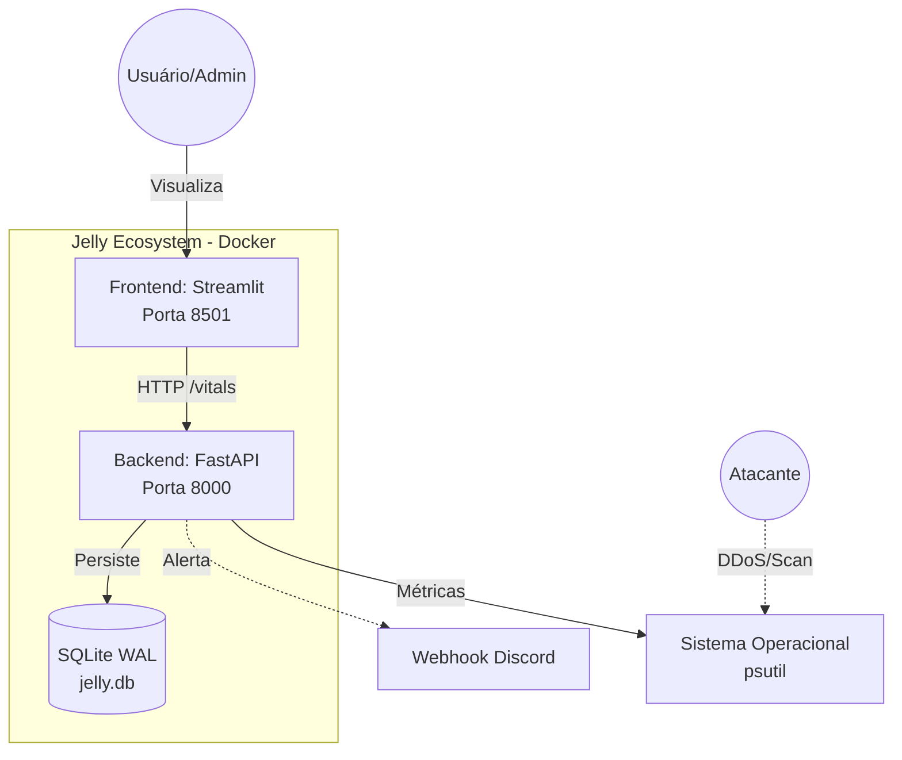
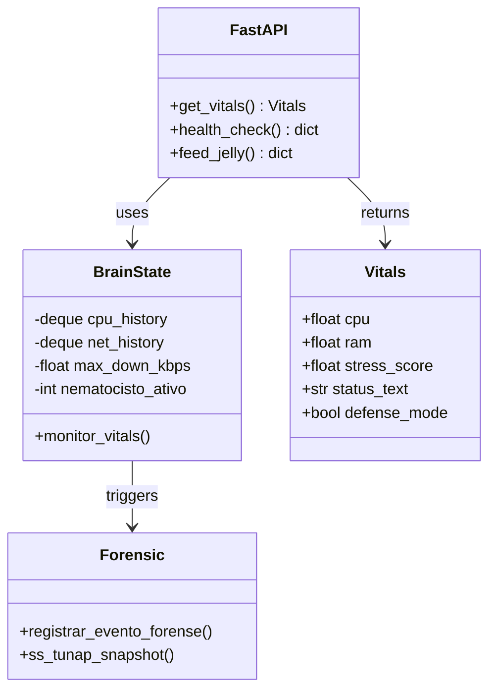
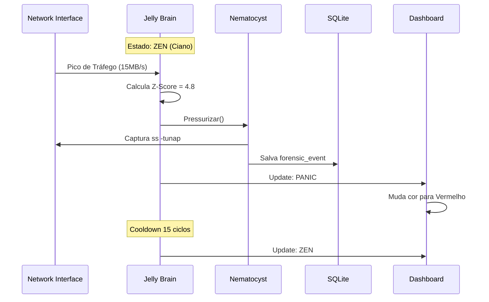
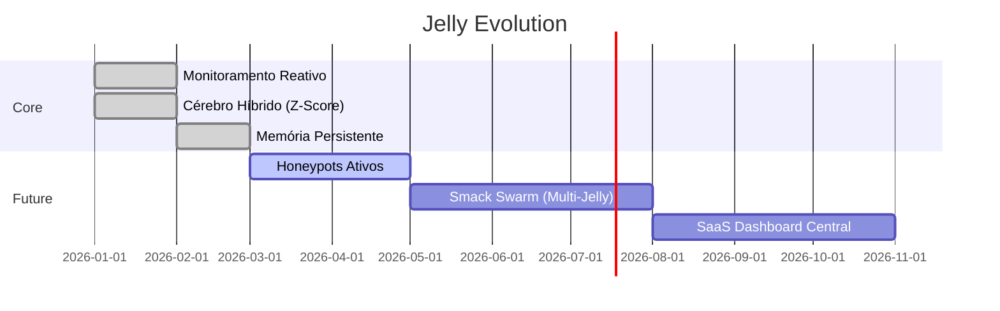

# 🪼 Jelly Nervous System (JNS) - Architecture

> *"A natureza não faz nada em vão."* - Aristóteles

A **Jelly** é um Sistema de Detecção de Intrusão (IDS) biomimético que utiliza conceitos de "Calm Technology" para monitorar a saúde de servidores e dispositivos Edge. Diferente de logs tradicionais, a Jelly traduz métricas de estresse em bioluminescência (cores HSL) e reage a ameaças disparando contramedidas defensivas (Nematocistos).

---

## 🏗️ Diagrama de Arquitetura



---

## 📋 Requisitos Funcionais

| ID | Requisito | Status |
|---|---|---|
| **RF001** | Monitorar CPU, RAM, Disco e Rede via psutil a cada 100ms | ✅ |
| **RF002** | Detectar anomalias via Z-Score (threshold > 3.0) | ✅ |
| **RF003** | Disparar Nematocisto (log forense + block IP) em anomalias críticas | ✅ |
| **RF004** | Interface biomimética com cores HSL dinâmicas (Ciano → Vermelho) | ✅ |
| **RF005** | Persistir histórico vital e eventos forenses em SQLite WAL | ✅ |
| **RF006** | Health check endpoint para Docker/Kubernetes | ✅ |

---

## 📋 Requisitos Não-Funcionais

| ID | Requisito | Implementação |
|---|---|---|
| **RNF001** | CPU < 5% em repouso | Loop otimizado + WAL |
| **RNF002** | Segurança: shell=False, sanitização de inputs | subprocess seguro |
| **RNF003** | Portabilidade: Linux/WSL/Docker | Container multi-arch |
| **RNF004** | Graceful shutdown em SIGTERM | Signal handler |

---

## 🧬 Diagrama de Classes



---

## 🔄 Diagrama de Sequência: Fluxo de Defesa



---

## 🛠️ Stack Tecnológica

| Camada | Tecnologia | Função |
|---|---|---|
| **Backend** | FastAPI + Uvicorn | API REST assíncrona |
| **Frontend** | Streamlit | Dashboard reativo |
| **Sensores** | Psutil | Coleta de métricas OS |
| **Matemática** | Statistics (StdDev) | Z-Score para anomalias |
| **Persistência** | SQLite WAL | Memória neural + forense |
| **Container** | Docker Compose | Orquestração brain + body |
| **CI/CD** | GitHub Actions | Testes automatizados |

---

## 🔮 Roadmap Evolutivo



### Fase 5: Imunidade de Rebanho (Smack Swarm)

A evolução natural do projeto é criar múltiplas Jellys conversando entre si:

- **Jellys Edge**: Rodam em cada dispositivo (Poco X4, servidores, IoT)
- **Jelly Queen**: Dashboard central que agrega dados de todas as Jellys
- **Protocolo Smack**: Jellys compartilham threats detectados (like feromônios)

```
[Edge Jelly 1] ---> [Queen API] <--- [Edge Jelly 2]
                        |
                   [Dashboard SaaS]
```

---

## 📂 Estrutura do Projeto

```
JellyV6/
├── brain.py           # Backend FastAPI + Lógica de detecção
├── app.py             # Frontend Streamlit + UI biomimética
├── jelly.db           # Memória persistente (SQLite WAL)
├── .env               # Segredos (JELLY_DNA_SECRET)
├── Dockerfile         # Container image
├── docker-compose.yml # Orquestração
├── tests/
│   └── test_zscore.py # Testes automatizados
└── .github/
    └── workflows/
        └── ci.yml     # GitHub Actions CI
```

---

Projeto desenvolvido por **codeZ** como estudo de caso em Cybersecurity Edge e MLOps.
