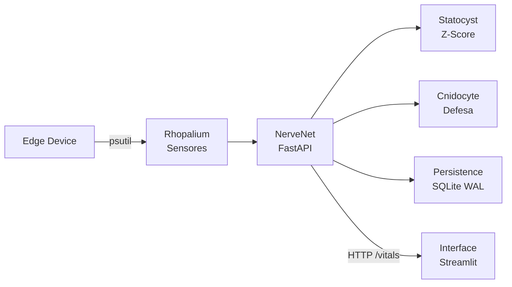

# Jelly V6: Cyanea Capillata Digitalis 🪼

[](https://github.com/codeZ21/JellyV6/actions)
[](https://www.python.org/downloads/)
[](LICENSE)
[](docker-compose.yml)

> *"A natureza não faz nada em vão."* - Aristóteles

## 🧬 Classificação Científica / Taxonomia Digital

| Categoria | Classificação Digital |
| :--- | :--- |
| **Nome Científico** | *Cyanea Capillata Digitalis* |
| **Variedade** | *Forensis Bordealis* (Subespécie de Borda) |
| **Referência Biológica** | *Cyanea capillata* (Água-viva Juba de Leão) |
| **Reino** | Software Libera (Open Source) |
| **Filo** | Data-Driven Intelligence |
| **Classe** | Secure Edge MLOps |
| **Ordem** | Anomalia Estatística |
| **Família** | Cyber-Physical Observability |
| **Gênero** | *Cyanea* (Sentinelas de tentáculos múltiplos) |
| **Espécie** | *C. Digitalis* |

---

## 🏗️ Arquitetura NerveNet



> 📄 Documentação completa: [ARCHITECTURE.md](ARCHITECTURE.md)

---

## 📋 Prontuário do Espécime

*   **Habitat**: Ambientes de Borda (Edge Computing), redes descentralizadas e dispositivos móveis (ex: Poco X4).
*   **Morfologia**: Composta por uma **NerveNet** (FastAPI) e um **Corpo** (Streamlit), protegida por uma sequência de DNA específica (`X-JELLY-DNA`).
*   **Mecanismo de Defesa**: Arco reflexo baseado em **Z-Score**; injeta toxinas de log (SQLite) ao detectar flutuações anômalas no meio ambiente (Rede).
*   **Nutrição**: Fagocitose de pacotes de dados e métricas de telemetria em tempo real.

---

## 🧠 Anatomia do Sistema (NerveNet Modular)

| Módulo | Arquivo | Responsabilidade |
|---|---|---|
| **NerveNet** | `core/nervenet.py` | Orquestrador FastAPI + endpoints |
| **Rhopalium** | `core/rhopalium.py` | Sensores (psutil) |
| **Statocyst** | `core/statocyst.py` | Z-Score + stress CPU |
| **Cnidocyte** | `core/cnidocyte.py` | Defesa + cooldown + forense |
| **Persistence** | `core/persistence.py` | SQLite WAL |
| **Interface** | `interface/app.py` | Dashboard Streamlit |

### Bioluminescência Semântica
- **Corpo**: Saúde interna (CPU/RAM) → Ciano → Vermelho
- **Tentáculos**: Saúde externa (Rede) → Ciano → Roxo → Branco

---

## 🛡️ Mecanismos de Defesa & Metabolismo

| Conceito Biológico | Implementação Técnica | Função |
| :--- | :--- | :--- |
| **Homeostase** | Adaptive Stress Scoring | Aprende o "novo normal" |
| **Arco Reflexo** | Gatilhos Absolutos | CPU > 90% = pânico imediato |
| **Nematocisto** | Forensic Logging | Captura evidências no momento da anomalia |
| **DNA** | Auth Header | Token `X-JELLY-DNA` para autenticação |

---

## 🚀 Quick Start

### Com Docker (Recomendado)
```bash
git clone https://github.com/codeZ21/JellyV6.git
cd JellyV6
echo "JELLY_DNA_SECRET=seu_segredo_aqui" > .env

docker-compose up -d

# Brain API: http://localhost:8000/docs
# Dashboard: http://localhost:8501
```

### Sem Docker
```bash
python -m venv jelly_env
source jelly_env/bin/activate
pip install -r requirements.txt

# Terminal 1: NerveNet
uvicorn core.nervenet:app --host 0.0.0.0 --port 8000

# Terminal 2: Interface
streamlit run interface/app.py
```

---

## 🧪 Testes

```bash
pytest tests/ -v

# Demo de ataque
python scripts/predator.py
```

---

## 📂 Estrutura de Arquivos

```
JellyV6/
├── core/                  # 🧠 NerveNet (Rede Nervosa)
│   ├── __init__.py
│   ├── nervenet.py        # Orquestrador FastAPI
│   ├── rhopalium.py       # Sensores (psutil)
│   ├── statocyst.py       # Z-Score + stress
│   ├── cnidocyte.py       # Defesa + forense
│   └── persistence.py     # SQLite WAL
│
├── interface/             # 🪼 Corpo (Dashboard)
│   └── app.py             # Streamlit
│
├── tests/                 # 🧪 Testes
│   └── test_zscore.py
│
├── scripts/               # 🦈 Scripts de demo
│   └── predator.py
│
├── .env                   # Segredos
├── Dockerfile
├── docker-compose.yml
├── ARCHITECTURE.md
└── README.md
```

---

## 🔮 Roadmap Evolutivo

- [x] **Fase 1**: Monitoramento Reativo (Cores)
- [x] **Fase 2**: Cérebro Híbrido (Estatística + Adaptação)
- [x] **Fase 3**: Memória Persistente e Forense
- [x] **Fase 3.5**: Refatoração NerveNet (Modular)
- [ ] **Fase 4**: Honeypots Ativos (Portas Falsas)
- [ ] **Fase 5**: Imunidade de Rebanho (Smack Swarm - SaaS)

> Fase 5 transforma as Jellys Edge em um enxame distribuído com Dashboard Central. [Saiba mais](ARCHITECTURE.md)

---

<p align="center">
  <b>Desenvolvido por codeZ 🪼</b><br>
  <i>Secure Edge MLOps • Bio-Inspired Cybersecurity</i>
</p>
