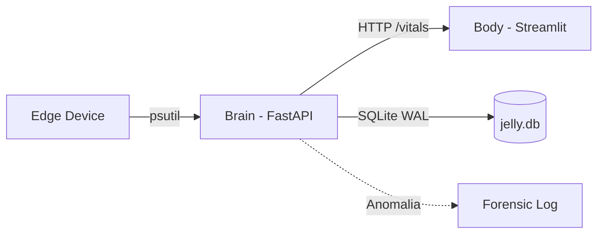

# Jelly V6: Cyanea Capillata Digitalis 🪼

[](https://github.com/codeZ21/JellyV6/actions)
[](https://www.python.org/downloads/)
[](LICENSE)
[](docker-compose.yml)

> *"A natureza não faz nada em vão."* - Aristóteles

## 🧬 Classificação Científica / Taxonomia Digital

| Categoria | Classificação Digital |
| :--- | :--- |
| **Nome Científico** | *Cyanea Capillata Digitalis* |
| **Variedade** | *Forensis Bordealis* (Subespécie de Borda) |
| **Referência Biológica** | *Cyanea capillata* (Água-viva Juba de Leão) |
| **Reino** | Software Libera (Open Source) |
| **Filo** | Data-Driven Intelligence |
| **Classe** | Secure Edge MLOps |
| **Ordem** | Anomalia Estatística |
| **Família** | Cyber-Physical Observability |
| **Gênero** | *Cyanea* (Sentinelas de tentáculos múltiplos) |
| **Espécie** | *C. Digitalis* |

---

## 🏗️ Arquitetura



> 📄 Documentação completa: [ARCHITECTURE.md](ARCHITECTURE.md)

---

## 📋 Prontuário do Espécime

*   **Habitat**: Ambientes de Borda (Edge Computing), redes descentralizadas e dispositivos móveis (ex: Poco X4).
*   **Morfologia**: Composta por um **Cérebro** (FastAPI) e um **Corpo** (Streamlit), protegida por uma sequência de DNA específica (`X-JELLY-DNA`).
*   **Mecanismo de Defesa**: Arco reflexo baseado em **Z-Score**; injeta toxinas de log (SQLite) ao detectar flutuações anômalas no meio ambiente (Rede).
*   **Nutrição**: Fagocitose de pacotes de dados e métricas de telemetria em tempo real.

---

## 🧠 Anatomia do Sistema

### 1. O Cérebro (`brain.py`) - Backend FastAPI
*   **Neuroplasticidade (CPU)**: Utiliza médias móveis para "aprender" o que é uma carga normal.
*   **Z-Score (Rede)**: Detecta anomalias estatísticas (picos súbitos).
*   **Memória de Longo Prazo**: SQLite com **WAL Mode**.
*   **Nematocistos (Forense)**: Ao detectar perigo, executa `ss -tunap` e salva snapshot.

### 2. O Corpo (`app.py`) - Frontend Streamlit
*   **Bioluminescência**: Cores HSL dinâmicas (Ciano → Vermelho).
*   **Tentáculos Visuais**: Partículas CSS reativas à velocidade da rede.

---

## 🛡️ Mecanismos de Defesa & Metabolismo

| Conceito Biológico | Implementação Técnica | Função |
| :--- | :--- | :--- |
| **Homeostase** | Adaptive Stress Scoring | Aprende o "novo normal" |
| **Arco Reflexo** | Gatilhos Absolutos | CPU > 90% = pânico imediato |
| **Nematocisto** | Forensic Logging | Captura evidências no momento da anomalia |
| **DNA** | Auth Header | Token `X-JELLY-DNA` para autenticação |

---

## 🚀 Quick Start

### Com Docker (Recomendado)
```bash
# Clone e configure
git clone https://github.com/codeZ21/JellyV6.git
cd JellyV6
echo "JELLY_DNA_SECRET=seu_segredo_aqui" > .env

# Suba os containers
docker-compose up -d

# Acesse
# Brain API: http://localhost:8000/docs
# Dashboard: http://localhost:8501
```

### Sem Docker
```bash
# Prepare o ambiente
python -m venv jelly_env
source jelly_env/bin/activate  # Linux/Mac
pip install -r requirements.txt

# Terminal 1: Cérebro
python brain.py

# Terminal 2: Corpo
streamlit run app.py
```

---

## 🧪 Testes

```bash
# Rodar testes
pytest tests/ -v

# Simular ataque (para demo)
python scripts/predator.py
```

---

## 📂 Estrutura de Arquivos

```
JellyV6/
├── brain.py           # Backend FastAPI
├── app.py             # Frontend Streamlit
├── jelly.db           # Memória persistente
├── .env               # Segredos
├── Dockerfile         # Container image
├── docker-compose.yml # Orquestração
├── ARCHITECTURE.md    # Documentação técnica
├── tests/             # Testes automatizados
└── scripts/           # Scripts de demo
```

---

## 🔮 Roadmap Evolutivo

- [x] **Fase 1**: Monitoramento Reativo (Cores)
- [x] **Fase 2**: Cérebro Híbrido (Estatística + Adaptação)
- [x] **Fase 3**: Memória Persistente e Forense
- [ ] **Fase 4**: Honeypots Ativos (Portas Falsas)
- [ ] **Fase 5**: Imunidade de Rebanho (Smack Swarm - SaaS)

> Fase 5 transforma as Jellys Edge em um enxame distribuído com Dashboard Central. [Saiba mais](ARCHITECTURE.md#fase-5-imunidade-de-rebanho-smack-swarm)

---

## 📜 Licença

MIT License - Use, modifique e distribua livremente.

---

<p align="center">
  <b>Desenvolvido por codeZ 🪼</b><br>
  <i>Secure Edge MLOps • Bio-Inspired Cybersecurity</i>
</p>
