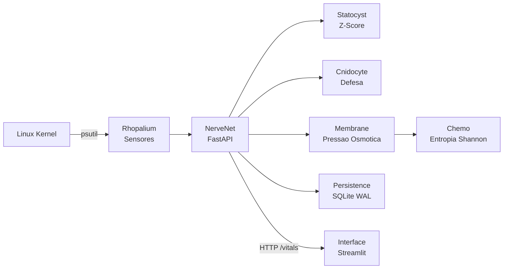

# Jelly V6: Cyanea Capillata Digitalis

[](https://github.com/codeZ-coder/JellyV6/actions)
[](https://www.python.org/downloads/)
[](LICENSE)
[](./docker-compose.yml)
[](.)

> *"A natureza nao faz nada em vao."* -- Aristoteles

---

### TL;DR

**Jelly V6** e um agente de **Observabilidade de Sistemas** e defesa cibernetica bio-inspirada. Ele monitora recursos do sistema (CPU, RAM, Rede), detecta anomalias via Z-Score e Entropia de Shannon, e oferece uma interface visual reativa inspirada na bioluminescencia de cnidarios. Funcionalidades de defesa ativa (bloqueio osmotico, resposta tatica) operam em tempo real via middleware FastAPI.

Desenvolvido para ambientes **Linux (WSL/Docker)**, com visao futura de portabilidade para dispositivos de borda (Android/Termux) como Relays de defesa distribuida.

---

### Sumario
- [Taxonomia Digital](#classificacao-cientifica--taxonomia-digital)
- [Arquitetura NerveNet](#arquitetura-nervenet)
- [Triade CID](#triade-cid-confidencialidade-integridade-disponibilidade)
- [Smack: Defesa Cooperativa](#smack-a-defesa-cooperativa)
- [Bioluminescencia](#bioluminescencia-system-status)
- [Quick Start](#quick-start)
- [Testes](#testes--stress)
- [Seguranca e Etica](#seguranca-e-uso-responsavel)
- [Roadmap](#roadmap-de-evolucao)

---

## Classificacao Cientifica / Taxonomia Digital

| Categoria | Classificacao Digital |
| :--- | :--- |
| **Nome Cientifico** | *Cyanea Capillata Digitalis* |
| **Variedade** | *Forensis Laboratorial* (Ambiente Linux) |
| **Filo** | Data-Driven Intelligence |
| **Classe** | System Resource Observability |
| **Ordem** | Anomalia Estatistica |
| **Familia** | Linux-Based Systems |

---

## Arquitetura NerveNet

O sistema imita o sistema nervoso descentralizado de um cnidario. Nao ha cerebro central; cada modulo tem autonomia sensorial e decisoria.



### Anatomia do Sistema

| Modulo | Arquivo | Responsabilidade |
| :--- | :--- | :--- |
| **NerveNet** | `core/nervenet.py` | Orquestrador: API FastAPI, Middleware de defesa |
| **Rhopalium** | `core/rhopalium.py` | Sentidos: Coleta de metricas do OS (psutil) |
| **Statocyst** | `core/statocyst.py` | Equilibrio: Calculo de Z-Score e Stress |
| **Cnidocyte** | `core/cnidocyte.py` | Defesa: Disparo de resposta e registro forense |
| **Membrane** | `core/membrane.py` | Pele: Pressao osmotica por IP, decisao de bloqueio |
| **Chemoreceptor** | `core/chemo.py` | Paladar: Entropia de Shannon sobre lotes de trafego |
| **Persistence** | `core/persistence.py` | Memoria: SQLite WAL, forense assincrona |
| **Interface** | `interface/app.py` | Corpo: Dashboard reativo em Streamlit |

Documentacao tecnica detalhada: [ARCHITECTURE.md](ARCHITECTURE.md) | [docs/concepts.md](docs/concepts.md)

---

## Triade CID (Confidencialidade, Integridade, Disponibilidade)

A Jelly aplica os tres pilares classicos de seguranca da informacao:

**Confidencialidade:** O middleware `X-JELLY-DNA` valida cada requisicao. Apenas clientes com o token correto acessam os dados vitais. O frontend se identifica como `X-JELLY-TYPE: SOMATIC` (celula do proprio corpo) para bypass seletivo da defesa osmotica.

**Integridade (Turritopsis):** Baseado na agua-viva imortal *Turritopsis dohrnii*. Quando a pressao osmotica atinge niveis criticos (`RUPTURA_MESOGLEIA`), o sistema sinaliza para o orquestrador (Docker) reiniciar o container a partir de uma imagem limpa -- renascendo sem comprometimento. *(Implementacao parcial; verificacao de hash de arquivos planejada para Fase 2.)*

**Disponibilidade:** O algoritmo de Z-Score opera com custo computacional O(n) sobre contadores, evitando inspecao profunda de pacotes. O `sleep` adaptativo (`resp_speed`) ajusta o consumo de CPU ao nivel de estresse, garantindo que o sistema continue responsivo mesmo sob carga.

---

## Smack: A Defesa Cooperativa

> *"Nenhum de nos e tao inteligente quanto todos nos."* -- Proverbio Japones

Em biologia, um grupo de aguas-vivas e chamado de **Smack**. Na JellyV6, o Smack e a visao de **Defesa Cooperativa Distribuida**.

1. **Relays (Efiras):** Instancias leves (Android/Termux) atuam como sensores de borda. Se detectam um padrao de ataque, geram uma assinatura.
2. **Coelenteron (Tunel Seguro):** Comunicacao entre nos via VPN criptografada (WireGuard/mTLS). Apenas Jellys autenticadas compartilham dados.
3. **Imunidade de Rebanho:** Se um no detecta um IP malicioso, ele "vacina" o restante do Smack. O bloqueio se propaga para todos os nos.

*(O Smack e uma visao de longo prazo. O MVP atual opera como organismo solitario.)*

---

## Bioluminescencia (System Status)

O sistema comunica seu estado de saude atraves de padroes de cores HSL:

| Componente | Homeostase (Normal) | Alerta (Stress) | Panico (Critico) |
| :--- | :---: | :---: | :---: |
| **Corpo (Soma)** -- CPU/RAM | Ciano | Amarelo | Vermelho |
| **Tentaculos** -- Rede | Ciano | Roxo | Branco |
| **Mesogleia** -- Pressao Osmotica | Transparente | Amarelo pulsante | Vermelho com ions |

---

## Quick Start

### 1. Configuracao do DNA (.env)

Nunca comite suas chaves reais. Copie o arquivo de exemplo:

```bash
cp .env.example .env
# Edite o .env com sua chave
```

### 2. Com Docker (Recomendado)

```bash
git clone https://github.com/codeZ-coder/JellyV6.git
cd JellyV6
docker compose up --build -d

# Brain API: http://localhost:8000/docs
# Dashboard: http://localhost:8501
```

### 3. Localmente (Linux/WSL)

```bash
python3 -m venv jelly_env
source jelly_env/bin/activate
pip install -r requirements.txt

# Terminal A:
uvicorn core.nervenet:app --host 0.0.0.0 --port 8000

# Terminal B:
streamlit run interface/app.py
```

---

## Testes & Stress

```bash
# Testes unitarios
pytest tests/ -v

# Simulacao de ataque (Predator V2)
python scripts/predator.py --mode bot    # Testa deteccao de bots
python scripts/predator.py --mode human  # Testa falsos positivos
python scripts/predator.py --mode ddos   # Testa Z-Score de rede
```

---

## Seguranca e Uso Responsavel

### Boas Praticas
* Mantenha o arquivo `.env` fora do controle de versao (ja configurado no `.gitignore`).
* Em producao, altere a `JELLY_DNA_SECRET` para um hash forte e unico.
* Use `.env.example` como referencia para novos deployments.

### Aviso Legal
> Esta ferramenta foi desenvolvida estritamente para fins de testes em ambientes controlados (Localhost/WSL). O uso nao autorizado contra alvos de terceiros e ilegal e antietico.

---

## Roadmap de Evolucao

O projeto segue o ciclo de vida de um cnidario, evoluindo de um no unico para uma colonia.

### Fase 1: Homeostase (MVP Atual -- Operacional)

- [x] **Rhopalium (Sensores):** Coleta em tempo real de CPU, RAM, Disco e Rede via psutil.
- [x] **Statocyst (Equilibrio):** Deteccao de anomalias via Z-Score estatistico.
- [x] **Cnidocyte (Defesa):** Resposta ativa (bloqueio de IP) e registro forense assincrono.
- [x] **Membrana Osmotica:** Filtragem por pressao de requisicoes e analise de Entropia de Shannon.
- [x] **Nematocisto:** Resposta tatica (GZIP Bomb / Tarpit) via Middleware FastAPI.
- [x] **Bioluminescencia:** Interface visual reativa em Streamlit (cores HSL).
- [x] **Confidencialidade (CID):** Middleware X-JELLY-DNA validado.

### Fase 2: Estrobilizacao (Proximo Passo)

- [ ] **Reflexo Imediato (Gosto Acido):** Deteccao instantanea de payloads maliciosos (SQLi, Path Traversal) sem esperar o buffer.
- [ ] **Protocolo Turritopsis (Integridade):** Verificacao de hash de arquivos e sinal de RUPTURA para auto-reinicio de containers.
- [ ] **Inercia do Nado (Eficiencia):** Rate limiting adaptativo com media movel em vez de degraus fixos.
- [ ] **Modo Efira (Mobile):** Versao leve para Android/Termux com logica de bateria.
- [ ] **Canary Files (Wiesner):** Arquivos isca para deteccao de leitura nao autorizada.

### Fase 3: O Smack (Visao de Longo Prazo)

- [ ] **Coelenteron:** VPN/mTLS para comunicacao segura entre nos.
- [ ] **Imunidade de Rebanho:** Compartilhamento de blocklists via Gossip Protocol.
- [ ] **Sensor Penzias (Noise Floor):** Filtro de ruido de rede para ataques Low-and-Slow.
- [ ] **Honeypot Berferd (Bolsa Gastrica):** Container isolado que simula vulnerabilidades para coletar inteligencia.

---

<div align="center">
  <b>Desenvolvido por codeZ</b><br>
  <i>Secure Edge MLOps | Bio-Inspired Cybersecurity</i>
</div>
