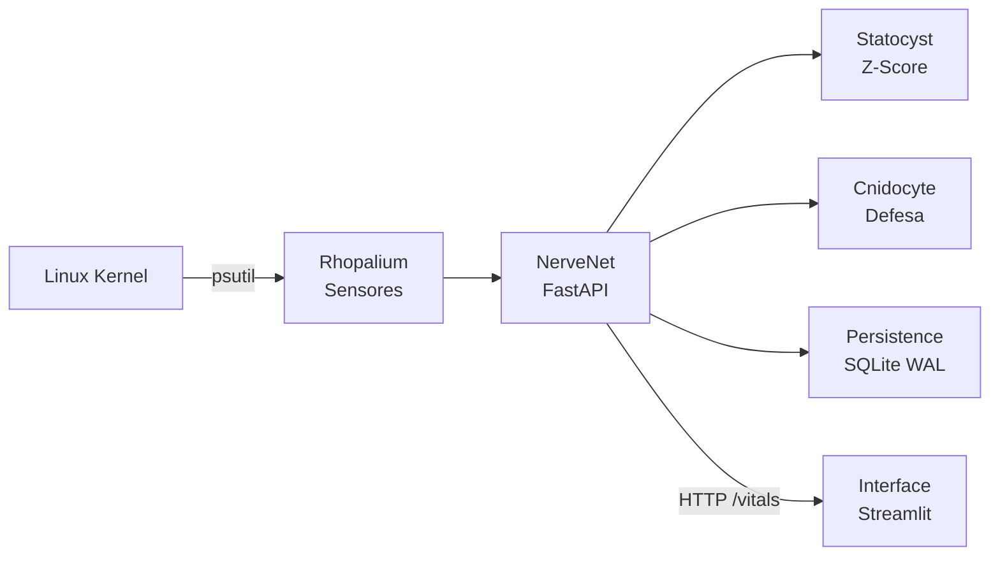

# Jelly V6: Cyanea Capillata Digitalis 🪼

[](https://github.com/codeZ-coder/JellyV6/actions)
[](https://www.python.org/downloads/)
[](LICENSE)
[](./docker-compose.yml)
[](.)

> *"A natureza não faz nada em vão."* — Aristóteles

---

### ⚡ TL;DR (Resumo Técnico)
**Jelly V6** é um agente de **Observabilidade de Sistemas** e defesa cibernética leve. Atualmente desenvolvido em ambiente **Linux (WSL/Docker)**, ele monitora recursos (CPU/RAM), detecta anomalias via Z-Score (estatística) e oferece uma interface visual interativa inspirada em sistemas biológicos.

*Meta futura: Portabilidade para dispositivos de borda (Android/Termux).*

---

### 📑 Sumário
- [Taxonomia Digital](#-classificação-científica--taxonomia-digital)
- [Arquitetura (NerveNet)](#️-arquitetura-nervenet)
- [Bioluminescência (Status)](#-bioluminescência-system-status)
- [Instalação (Quick Start)](#-quick-start)
- [Segurança & Ética](#-segurança-e-uso-responsável)
- [Roadmap](#-roadmap-evolutivo)

---

## 🧬 Classificação Científica / Taxonomia Digital

| Categoria | Classificação Digital |
| :--- | :--- |
| **Nome Científico** | *Cyanea Capillata Digitalis* |
| **Variedade** | *Forensis Laboratorial* (Ambiente Linux) |
| **Filo** | Data-Driven Intelligence |
| **Classe** | System Resource Observability |
| **Ordem** | Anomalia Estatística |
| **Família** | Linux-Based Systems |

---

## 🏗️ Arquitetura NerveNet

O sistema imita o sistema nervoso descentralizado de um cnidário:



### 🧠 Anatomia do Sistema (Módulos)

| Módulo | Arquivo | Responsabilidade |
| :--- | :--- | :--- |
| **NerveNet** | `core/nervenet.py` | Orquestrador: API FastAPI + Endpoints |
| **Rhopalium** | `core/rhopalium.py` | Sentidos: Coleta de métricas do OS (psutil) |
| **Statocyst** | `core/statocyst.py` | Equilíbrio: Cálculo de Z-Score e Stress |
| **Cnidocyte** | `core/cnidocyte.py` | Defesa: Mecanismo de resposta e forense |
| **Persistence** | `core/persistence.py` | Memória: Banco de dados SQLite (WAL Mode) |
| **Interface** | `interface/app.py` | Corpo: Dashboard interativo em Streamlit |

Example docs: [ARCHITECTURE.md](ARCHITECTURE.md)

---

## 🔵 Bioluminescência (System Status)

O sistema comunica seu estado de saúde (Health Check) através de padrões de cores:

| Componente | 🟢 Homeostase (Normal) | 🟡 Alerta (Stress) | 🔴 Pânico (Crítico) |
| :--- | :---: | :---: | :---: |
| **Corpo (Soma)**<br>*(CPU/RAM)* | **Ciano**<br>`Eficiente` | **Amarelo**<br>`Processamento Intenso` | **Vermelho**<br>`Sobrecarga` |
| **Tentáculos**<br>*(Rede)* | **Ciano**<br>`Estável` | **Roxo**<br>`Congestionamento` | **Branco**<br>`Perda de Sinal/Ataque` |

---

## � Quick Start

### 1. Configuração do DNA (.env)
⚠️ **Nunca comite suas chaves reais.** Crie um arquivo `.env` baseado no exemplo abaixo:

```bash
# .env.example (Copie este conteúdo para .env)
JELLY_DNA_SECRET=changeme_dev_key
JELLY_LOG_LEVEL=INFO
JELLY_DB_PATH=jelly.db
```

### 2. Rodando com Docker (Recomendado)

```bash
git clone https://github.com/codeZ-coder/JellyV6.git
cd JellyV6
docker compose up --build -d

# 🧠 Brain API: http://localhost:8000/docs
# 🪼 Dashboard: http://localhost:8501
```

### 3. Rodando Localmente (Linux/WSL)

```bash
# Configurar ambiente virtual
python3 -m venv jelly_env
source jelly_env/bin/activate

# Instalar dependências
pip install -r requirements.txt

# Rodar (em terminais separados)
# Terminal A:
uvicorn core.nervenet:app --host 0.0.0.0 --port 8000

# Terminal B:
streamlit run interface/app.py
```

---

## 🧪 Testes & Stress

```bash
# Rodar testes unitários
pytest tests/ -v

# ⚠️ Simulação de Ataque (Predator)
# Simula um DDoS local para testar o Z-Score
python scripts/predator.py
```

---

## � Segurança e Uso Responsável

### 🛡️ Boas Práticas
*   Mantenha o arquivo `.env` no seu `.gitignore`.
*   Em produção, altere a `JELLY_DNA_SECRET` para um hash forte.

### ⚠️ Aviso Legal
> Esta ferramenta foi desenvolvida estritamente para fins de testes em ambientes controlados (Localhost/WSL). O uso não autorizado contra alvos de terceiros é ilegal e antiético.

---

## 🔮 Roadmap Evolutivo

- [x] **Fase 1**: Monitoramento de Recursos Linux (WSL/Server)
- [x] **Fase 2**: Refinamento do Z-Score e Persistência Forense
- [x] **Fase 3**: Modularização da Arquitetura (NerveNet)
- [ ] **Fase 4**: Honeypots Ativos e Portas Falsas
- [ ] **Fase 5**: Imunidade de Rebanho (SaaS)
- [ ] **Fase 6**: Reescrever o Núcleo (NerveNet) em **Go** ou **Rust** para performance extrema 🚀

---

<div align="center">
  <b>Desenvolvido por codeZ 🪼</b><br>
  <i>Secure Edge MLOps • Bio-Inspired Cybersecurity</i>
</div>
