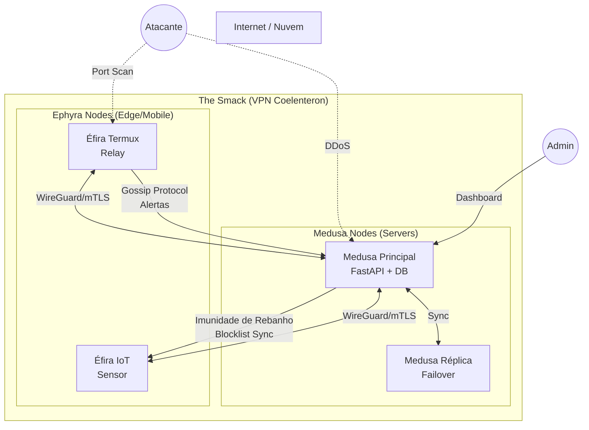

# 🪼 Jelly Nervous System v2 - Distributed Architecture

> *"A segurança não é um produto, é um processo biológico."* - Adaptação de Bruce Schneier

Este documento descreve a **Arquitetura Distribuída e Polimórfica** da JellyV6 (versão Penzias/Singh). Diferente da v1 (focada em um único nó Docker), a v2 projeta um ecossistema completo de defesa cibernética inspirado em cnidários.

---

## 🏗️ Diagrama de Rede: O Smack (Mesh Network)

O sistema deixa de ser um "IDS de Servidor" para ser uma **Colônia de Defesa**.

### Componentes de Rede:
1.  **Medusa Node:** O cérebro. Roda o stack completo (API, DB, UI). Centraliza a inteligência.
2.  **Ephyra Node:** Sensores leves (Python puro). Rodam em Android, Raspberry Pi ou containers efêmeros.
3.  **Coelenteron:** A rede privada (VPN) que conecta todos os nós, protegida por chaves assimétricas.

---

## 🧬 Diagrama de Classes: Polimorfismo Cnidário

A arquitetura de software agora suporta múltiplos "Estágios de Vida" (Polyp, Ephyra, Medusa) através de injeção de dependência e *Feature Flags*.

```mermaid
classDiagram
    class LifeStage {
        <<Enumeration>>
        POLYP
        EPHYRA
        MEDUSA
    }

    class NerveNet {
        +mode: LifeStage
        +start()
    }

    class Rhopalium {
        +sense_vitals()
        +sense_noise_floor()
    }

    class Statocyst {
        +analyze_entropy()
        +detect_anomaly()
    }

    class Cnidocyte {
        +fire_nematocyst()
        +inject_neurotoxin()
    }

    class Persistence {
        +save_forensics()
    }

    class Interface {
        +render_dashboard()
    }

    %% Relações Polimórficas
    NerveNet --> Rhopalium : Sempre usa
    NerveNet --> Cnidocyte : Sempre usa
    
    %% Condicionais
    NerveNet ..> Statocyst : Apenas Medusa/Ephyra
    NerveNet ..> Persistence : Apenas Medusa
    NerveNet ..> Interface : Apenas Medusa

    note for NerveNet "Configurado via JELLY_LIFE_STAGE"
```

---

## 📋 Matriz de Funcionalidades por Estágio de Vida

| Módulo | Componente | 🥔 Pólipo (Lite) | 📱 Éfira (Edge) | 🪼 Medusa (Core) |
| :--- | :--- | :---: | :---: | :---: |
| **NerveNet** | Core Loop | ✅ Simples (While True) | ✅ AsyncIO | ✅ FastAPI |
| **Rhopalium** | Psutil Sensors | ✅ CPU/RAM | ✅ + Network + Temp | ✅ Full + Docker Stats |
| **Rhopalium** | Cosmic Sensor | ❌ | ✅ (Penzias Noise) | ✅ (Deep Analytics) |
| **Statocyst** | Anomaly Detection | ❌ (Hard Threshold) | ✅ (Z-Score Local) | ✅ (AI/Heurística) |
| **Cnidocyte** | Resposta Ativa | ✅ (Block IP) | ✅ (Report + Tarpit) | ✅ (Full + Forense) |
| **Coelenteron**| VPN/Sync | ❌ (Logs Locais) | ✅ (Client) | ✅ (Server/Hub) |
| **Interface** | UI | ❌ CLI/Log | ❌ CLI/API | ✅ Streamlit Dashboard |
| **Persistence**| Database | ❌ Text Files | ❌ In-Memory | ✅ SQLite WAL |

---

## 🔢 A Alma Matemática (Novos Módulos)

A v2 introduz módulos inspirados na matemática histórica (Simon Singh):

1.  **Rhopalium "Penzias":**
    *   *Input:* Tráfego de rede bruto.
    *   *Proc:* Calcula temperatura basal (entropia) e isotropia.
    *   *Output:* Alerta de *Low-and-Slow*.

2.  **Cnidocyte "Vigenère":**
    *   *Ação:* Rotação de chaves e portas (Port Hopping).
    *   *Trigger:* Tempo ou detecção de sondagem.

3.  **Cnidocil "Wiesner":**
    *   *Mecanismo:* Canary Files (Arquivos isca).
    *   *Trigger:* Acesso de leitura ("Observação").
    *   *Efeito:* Colapso da função de onda (Alerta Imediato).

---

## 🔮 Roadmap v2

1.  **Refatoração do Core:** Implementar a checagem `JELLY_LIFE_STAGE` no `main.py`.
2.  **Criação da Éfira:** Script Python único (`ephyra.py`) sem dependências pesadas (só `requests` e `psutil`).
3.  **Túnel Coelenteron:** Configuração de WireGuard automatizada.
